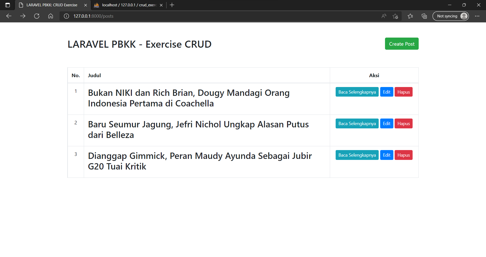

## Halaman Awal
 

 
## Membuat Post baru
Tampilan membuat post baru
 

 
Berhasil membuat post baru
 

 
## Melihat isi Post
 

 
## Mengedit Post
Mengedit judul post
 

 
Berhasil mengedit judul post
 

## Menghapus post
Memerlukan konfirmasi sebelum menghapus post
 

 
Menghapus post berhasil
 

